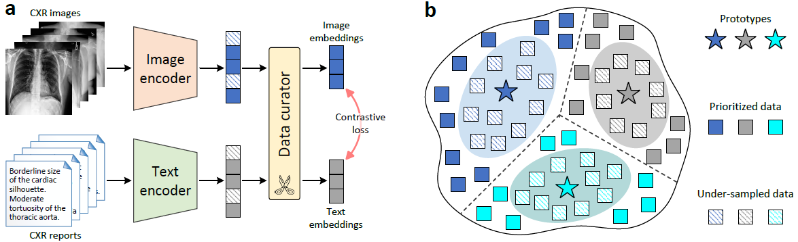

## CheXficient

This repository provides the implementation of the paper [A data- and compute-efficient chest X-ray foundation model beyond aggressive scaling](https://arxiv.org/abs/2602.22843). 
CheXficient is a chest X-ray (CXR) foundation model developed within a contrastive language–image pretraining (CLIP) framework. 
Instead of relying on aggressive scaling, it emphasizes more effective utilization of training data to enhance both data efficiency and computational efficiency.
Through active data-curated pretraining, CheXficient achieves competitive performance while requiring substantially fewer data and compute resources, 
offering a practical approach for scalable medical imaging foundation models.


```bibtex 
@article{wang2026data,
  title={A data-and compute-efficient chest X-ray foundation model beyond aggressive scaling},
  author={Wang, Chong and Zhang, Yabin and Gao, Yunhe and Varma, Maya and Mottez, Clemence and Patsatzi, Faidra and Liu, Jiaming and Long, Jin and Delbrouck, Jean-Benoit and Gatidis, Sergios and others},
  journal={arXiv preprint arXiv:2602.22843},
  year={2026}
}
```


## Quick Links

  - [Overview](#overview)
  - [Getting Started](#getting-started)
    - [Prepare Encoder](#prepare-encoder)
    - [Download Pretrained CheXficient](#download-pretrained-CheXficient)
    - [Use CheXficient with PyTorch](#use-CheXficient-with-pytorch)
    - [Use CheXficient with Huggingface](#use-CheXficient-with-huggingface)
  - [Model List](#model-list)
  - [Evaluation](#evaluation)
    - [Non-adapted Evaluation](#non-adapted-evaluation)
    - [Downstream-adapted Evaluation](#downstream-adapted-evaluation)
  - [Training](#training)
  - [Bugs or Questions](#bugs-or-questions)
  - [Citation](#citation)


## Overview

CheXficient incorporates a prototype-driven online data curator during pretraining (a). 
A set of prototypes (i.e., prototypical centroids) is leveraged to approximate the underlying data manifold, 
enabling dynamic prioritization of informative CXR image–report data pairs for model optimization using the InfoNCE contrastive loss. 
Concretely, training samples that lie farther from the prototypes (corresponding to under-represented but informative regions of the data distribution) are emphasized, 
while samples near the prototypes, which tend to contain redundant information, are down-weighted and under-sampled (b).
The prototypes are updated concurrently with model training to reflect the evolving data distribution.




## Getting Started

This codebase is designed with minimal dependencies (tested under Python 3.10.17, PyTorch 2.1.1 and Transformers 4.52.4), see [here](environment.yml) for full details. The installation process typically takes less than one hour.

```bash 
pip install transformers==4.52.4
```

### Prepare Encoder
CheXficient leverages pre-trained vision and text encoders, 
such as [DINO-v2](https://github.com/facebookresearch/dinov2), [Bio_ClinicalBERT](https://huggingface.co/emilyalsentzer/Bio_ClinicalBERT), 
enabling flexible extension to other pre-trained vision and language models.
The corresponding model checkpoints are automatically downloaded in training.


### Download Pretrained CheXficient
```bash 
pip install gdown
gdown --folder https://drive.google.com/drive/folders/1ISHSL8wf6upI_dRigMFroTaUPbozNFmS
```
Check [Model List](#model-list) for other models.


### Use CheXficient with PyTorch
For PyTorch-based usage, you can utilize the following code to load CheXficient pretrained models (similar to resuming training in `main.py`):

```python 
import torch
import torchvision.transforms as transforms
from PIL import Image
import run_configs
from models_clip import CheXficient

config_name = "chexficient"
args = getattr(run_configs, config_name)()
model = CheXficient(image_size=args.image_size)
model.to(torch.device(f'cuda:{0}'))
tokenizer = model.text_encoder.tokenizer
image_transform = transforms.Compose([
            transforms.Resize(args.image_size, interpolation=Image.BICUBIC),
            transforms.CenterCrop(args.image_size),
            transforms.ToTensor(),
            transforms.Normalize(mean=[0.48145466, 0.4578275, 0.40821073], std=[0.26862954, 0.26130258, 0.27577711])
    ])

state_dict = torch.load(f"pretrained_models/pytorch_model.pth", map_location='cpu')['model']
res = model.load_state_dict(state_dict, strict=False)
model.eval()

inputs_text = tokenizer(["Pneumonia", "no Pneumonia"], padding="longest", truncation=True, max_length=args.max_bert_length, return_tensors="pt")
for key in inputs_text:
    inputs_text[key] = inputs_text[key].to(next(model.parameters()).device, non_blocking=True)
inputs_image = image_transform(Image.open("./CXR/images/5AF3BB6C1BCC83C.png").convert("RGB")).unsqueeze(0)
inputs_image = inputs_image.to(next(model.parameters()).device, non_blocking=True)
with torch.no_grad():
    text_embeds = model.encode_text(inputs_text)
    image_embeds = model.encode_image(inputs_image)
    cosine = image_embeds @ text_embeds.t()
print('prob:', cosine.softmax(dim=1))
```

### Use CheXficient with Huggingface
Please run the following to load checkpoints from [Huggingface](https://huggingface.co/StanfordAIMI/CheXficient).

```python 
import torch
from PIL import Image
from transformers import AutoModel, AutoTokenizer, AutoImageProcessor

repo_id = "StanfordAIMI/CheXficient"
device = "cuda" if torch.cuda.is_available() else "cpu"

model = AutoModel.from_pretrained(
    repo_id,
    trust_remote_code=True
).to(device)

tokenizer = AutoTokenizer.from_pretrained(repo_id, trust_remote_code=True)
image_processor = AutoImageProcessor.from_pretrained(repo_id, trust_remote_code=True)

model.eval()

image = Image.open("./CXR/images/5AF3BB6C1BCC83C.png").convert("RGB")
text = ["Pneumonia", "no Pneumonia"]

image_inputs = image_processor(images=image, return_tensors="pt").to(device)
text_inputs = tokenizer(text, padding=True, return_tensors="pt").to(device)

with torch.no_grad():
    outputs = model(
        pixel_values=image_inputs["pixel_values"],
        text_tokens=text_inputs,
    )
print(outputs)
```


## Model List
Our released models are listed as following. You can import them by the following Get Started/Evaluation section. 

| Model | Vision Encoder | Text Encoder |
|:-------------------------------|:--------------:|:------------:|
| [vit-b14-clip-378](https://drive.google.com/drive/folders/1ISHSL8wf6upI_dRigMFroTaUPbozNFmS?usp=sharing) | ViT-B/14 | BERT-base |

More models coming soon.


## Evaluation

### Non-adapted Evaluation
Please refer to ./clipeval/eval_zeroshot.py for non-adapted zero-shot evaluation on:

1) Findings classification;
2) Cross-modal retrieval.

### Downstream-adapted Evaluation:
Please refer to ./models_clip.py for downstream tasks like:

1. Classification (linear probing);
2. Segmentation (U-Net decoding);
3. Radiology report generation, we adopt the VLM framework from Microsoft’s [LLaVA-Rad](https://github.com/microsoft/LLaVA-Rad), 
replacing its original image encoder with our pre-trained vision encoder.


## Training

**Data**

An extensive training corpus of over 1.235 million CXR image–report pairs was collected from 13 public datasets:
[MIMIC-CXR](https://physionet.org/content/mimic-cxr-jpg/2.0.0);
[ReXGradient-160K](https://huggingface.co/datasets/rajpurkarlab/ReXGradient-160K);
[CheXpert-Plus](https://aimi.stanford.edu/datasets/chexpert-plus);
[PadChest](https://bimcv.cipf.es/bimcv-projects/padchest/);
[BIMCV-COVID19](https://bimcv.cipf.es/bimcv-projects/bimcv-covid19);
[CANDID-PTX](https://figshare.com/articles/dataset/CANDID-PTX/14173982);
[CASIA-CXR](https://github.com/microsoft/LLaVA-Rad);
[Open-I](https://openi.nlm.nih.gov/faq);
[NIH ChestX-ray14](https://nihcc.app.box.com/v/ChestXray-NIHCC/folder/36938765345);
[BRAX](https://physionet.org/content/brax/1.1.0);
[VinDr-CXR](https://github.com/microsoft/LLaVA-Rad);
[VinDr-PCXR](https://vindr.ai/datasets/pediatric-chest-x-ray);
[ChestDR](https://springernature.figshare.com/articles/dataset/ChestDR_Thoracic_Diseases_Screening_in_Chest_Radiography/22302775).

Note some of them (NIH ChestX-ray14, BRAX, VinDr-CXR, VinDr-PCXR, and ChestDR) do not provide free-text reports but instead include structured diagnostic labels (e.g., pleural effusion, cardiomegaly, atelectasis).
we generate pseudo-reports for them using a template-based report synthesis strategy introduced in [LLaVA-Rad](https://github.com/microsoft/LLaVA-Rad).

We preprocess all contributing datasets using simple filtering rules (e.g., excluding samples with empty CXR reports or invalid image–text pairs).
Implementation details can be found in the ./preprocess folder.


**Training scripts**

All example configuration settings are provided in configs.py. Data curation and model training are performed concurrently during the training process.

```bash 
python main.py    # a local training of the default setup on multiple GPUs.
```


**Single GPU Training**

Training can be performed on a single GPU using an embedding accumulation strategy (coming soon).


**Curated Data**

The curated subset from the raw training set is stored within the model checkpoint under the key "subset".
For example:

```python 
import torch
state_dict = torch.load(f"pretrained_models/pytorch_model.pth", map_location='cpu')
subset = state_dict['subset']
```


## Bugs or questions?

If you have any questions related to the code or the paper, feel free to email Chong Wang (`chongwa@stanford.edu`).


## Citation

Please cite our paper below if CheXficient contributes in your work:

```bibtex 
@article{wang2026data,
  title={A data-and compute-efficient chest X-ray foundation model beyond aggressive scaling},
  author={Wang, Chong and Zhang, Yabin and Gao, Yunhe and Varma, Maya and Mottez, Clemence and Patsatzi, Faidra and Liu, Jiaming and Long, Jin and Delbrouck, Jean-Benoit and Gatidis, Sergios and others},
  journal={arXiv preprint arXiv:2602.22843},
  year={2026}
}
```
